# テンプレート

**【種別】**

**【概要】**

**【利用技術】**

**【制作期間】**

**【工夫した点と苦労した点】**

**【リンクなど】**

# 0. 目次

| **番号** | **タイトル**                                                 |
| -------- | ------------------------------------------------------------ |
| **1**    | [**食パンの袋とめるアレ**](#1. 食パンの袋とめるアレ)         |
| **2**    | [**にゃんだーりすと**](#2. にゃんだーりすと)                 |
| **3**    | [**あかねちゃんタイマー**](#3. あかねちゃんタイマー)         |
| **4**    | [**Dinosour Run**](#4. Dinosour Run)                         |
| **5**    | [**プログラミング教室の教材**](#5, プログラミング教室の教材) |
| **6**    | [**ゲーム制作プロトタイプ**](#6. ゲーム制作のための実験)     |
| **7**    | [**二足歩行ロボット**](#7. 二足歩行ロボット)                 |
| **8**    | [**ゲームコントローラー**](#8. ゲームコントローラー)         |
| **9**    | [**その他電子工作**](#9. その他電子工作)                     |
| **10**   | [**その他制作物**]($10. その他制作物)                        |

# **1. 食パンの袋とめるアレ**

<iframe width="560" height="315" src="https://www.youtube.com/embed/vUrLMOghyeE" frameborder="0" allow="accelerometer; autoplay; encrypted-media; gyroscope; picture-in-picture" allowfullscreen></iframe>

**【種別】**
**Androidゲーム**

**【概要】**
**2Dアクションシューティングゲーム**

**【利用技術】**
**Unity**

**【制作期間】**
**4か月程度**

**【工夫した点と苦労した点】**
**ほげふが**

**【リンクなど】**

- **[Google Play Storeでの公開リンク](https://play.google.com/store/apps/details?id=com.Danny11.ArePac)**

- **[youtube リンク](https://www.youtube.com/watch?v=vUrLMOghyeE)**

**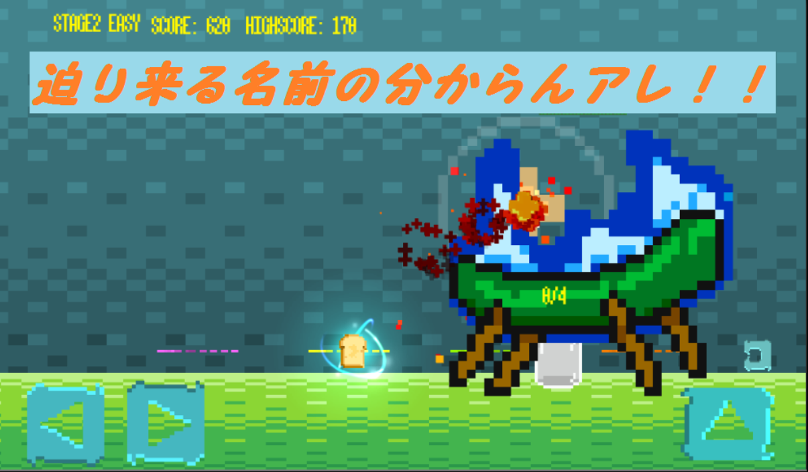**

**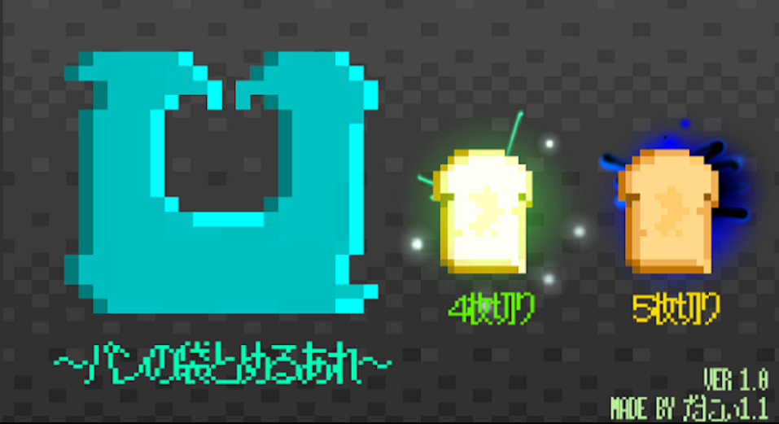**

**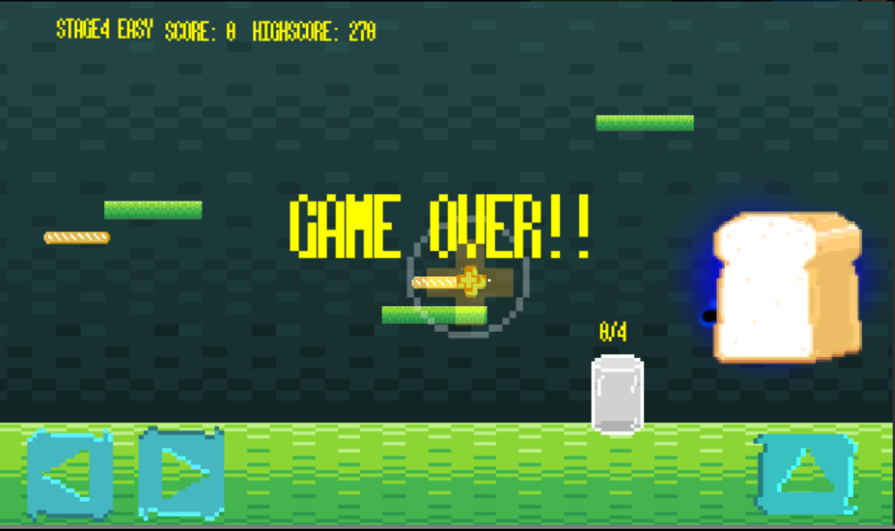**

# 2. にゃんだーりすと

****

**【種別】**
**Android アプリ**

**【概要】**
**旧Wunderlistを模倣したtodoアプリ**

**【利用技術】**
**Android, Java, GitHub, SQL**

**【制作期間】**
**一か月程度**

**【工夫した点と苦労した点】**
**ほげ**

**【リンクなど】**
**GitHub: [ToDoAppWithSQLite](https://github.com/dimorportheca47/ToDoAppWithSQLite-master)**

# **3. あかねちゃんタイマー**

**【種別】**
**Windowsアプリケーション**

**【概要】**
**Gitプロジェクトの未commit数の確認と、作業時間の管理ができるアプリ**

**【利用技術】**
**Java, Swing, PowerShell**

**【制作期間】**
**二か月程度**

**【工夫した点と苦労した点】**
**ほげ**

**【リンクなど】**
**[GitHub リンク](https://github.com/dannyso16/akane-timer)**

**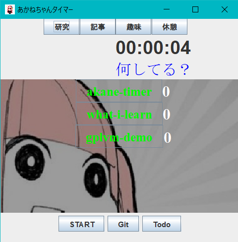**

# **4. Dinosour Run**

**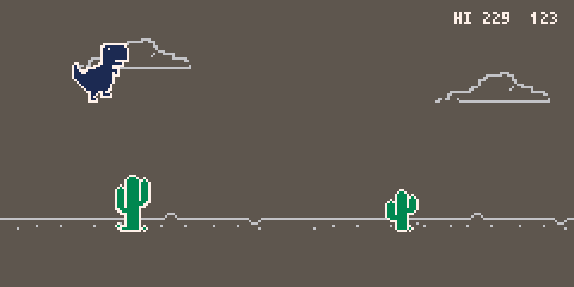**

**【種別】**
**PCゲーム**

**【概要】**
**オフラインの時によく見るランゲーム**

**【利用技術】**
**Pythonのレトロゲームエンジンpyxel**

**【制作期間】**
**一週間**

**【工夫した点と苦労した点】**
**ほげ**

**【リンクなど】**
**オープンソースのpyxel wiki にのった**

**[GitHubリンク](https://github.com/dannyso16/pynasour)**

# **5. プログラミング教室の教材**

**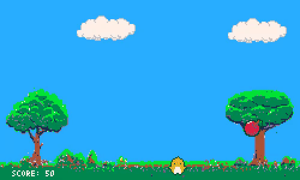**

**【種別】**
**PCゲームとテキスト**

**【概要】**
**2019夏に個人開催したプログラミング教室で使用した教材**

**【利用技術】**
**Pythonのレトロゲームエンジンpyxel**

**【制作期間】**
**一か月**

**【工夫した点と苦労した点】**
**ほげ**

**【リンクなど】**
**[GitHubリンクつける]**

# **6. ゲーム制作のための実験**

**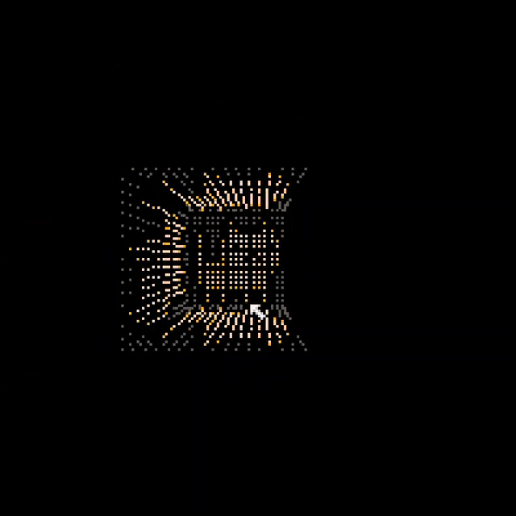**

**【種別】**
**プロトタイプ**

**【概要】**
**ゲーム制作に使えそうなアイデアを試したもの**

**【利用技術】**
**Python, Java, Javascriptなど**

**【制作期間】**
**各位一週間から一か月**

**【工夫した点と苦労した点】**
**ほげ**

**【リンクなど】**

**https://qiita.com/odanny/items/297f32a334c41410cc5d**

**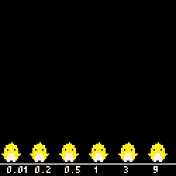**

**比較**

**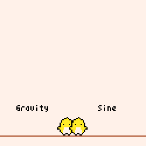**

**ゆらゆら**

****

**https://github.com/dannyso16/flocking**

****

**https://qiita.com/odanny/items/e0c0a00e13c2b4839cec**

****

**文字認識**

**https://github.com/dannyso16/pyxelDigitRecognition**

**https://qiita.com/odanny/items/eee3d99522bb01fdd111**

**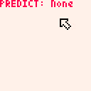**

**https://o-danny.itch.io/clickingbuttonsimulator**

**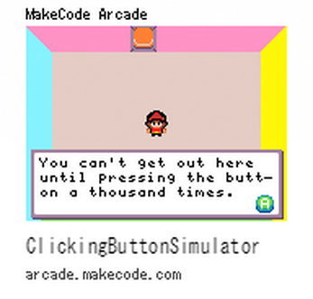**

# **7. 二足歩行ロボット**

****

**【種別】**
**電子工作**

**【概要】**
**サーボモーター4つ使用した二足歩行ロボット**

**【利用技術】**
**Arduino**

**【制作期間】**
**一、二か月**

**【工夫した点と苦労した点】**
**すべて**

**【リンクなど】**

# **8. ゲームコントローラー**

**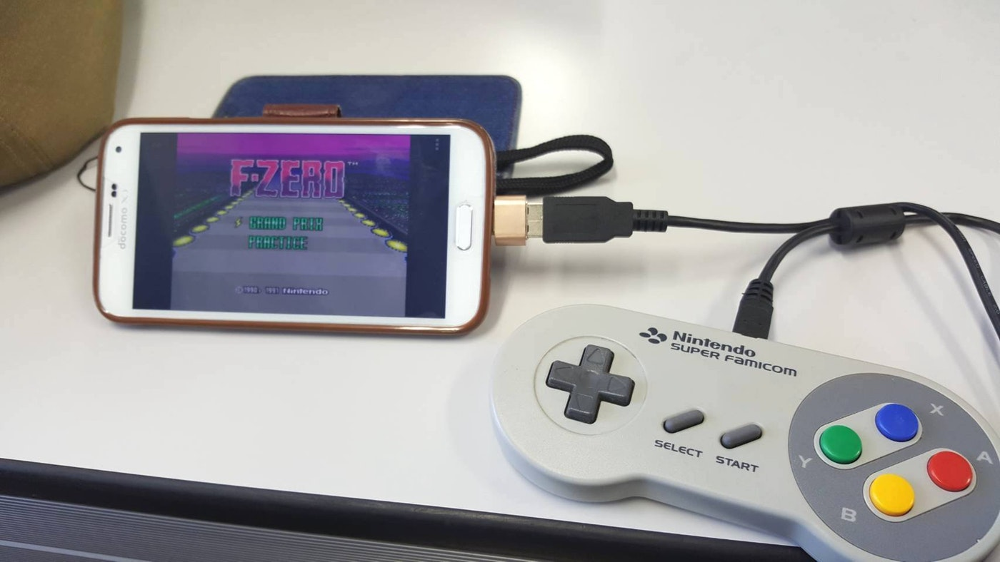**

**【種別】**
**電子工作**

**【概要】**
**スーパーファミコンや任天堂64のコントローラーをUSB化した**

**【利用技術】**
**Arduino**

**【制作期間】**
**一、二か月**

**【工夫した点と苦労した点】**
**すべて**

**【リンクなど】**

- **[記事](https://qiita.com/odanny/items/686d2e3f2061c12f156f)**

**中身**

**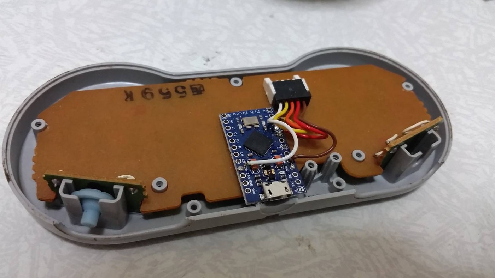**

# **9. その他電子工作**

****

**【種別】**
**プロトタイプ**

**【概要】**
**アイデアベースで試作したもの**

**【利用技術】**
**Arduino, Raspberry pi, Linux**

**【制作期間】**
**各一週間程度**

**【工夫した点と苦労した点】**
**すべて**

**【リンクなど】**

**NAS(Raspberry pi)**

# **10. その他制作物**

**【種別】**
**イラストなど**

**【概要】**
**ソフトウェアエンジニアには関係のない制作物**

**【利用技術】**

**【制作期間】**
**各数日程度**

**【工夫した点と苦労した点】**

**【リンクなど】**

**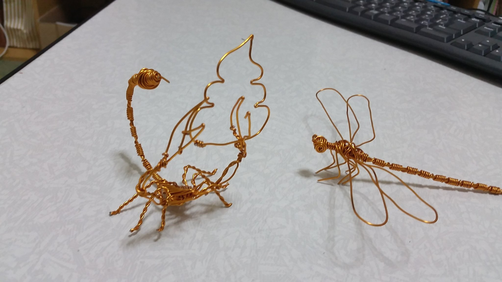**

**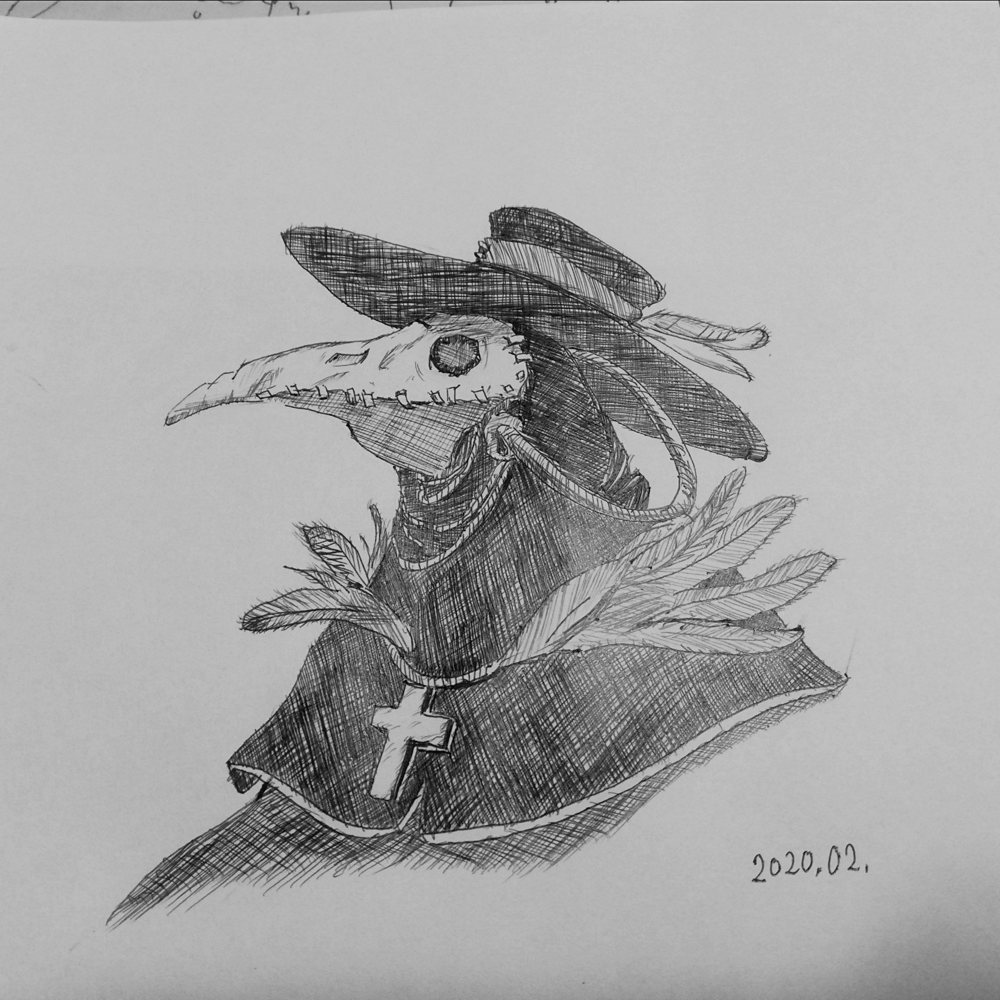**

**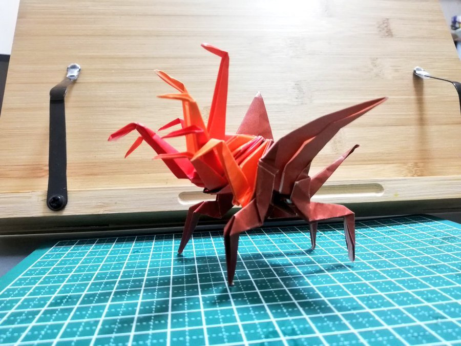**