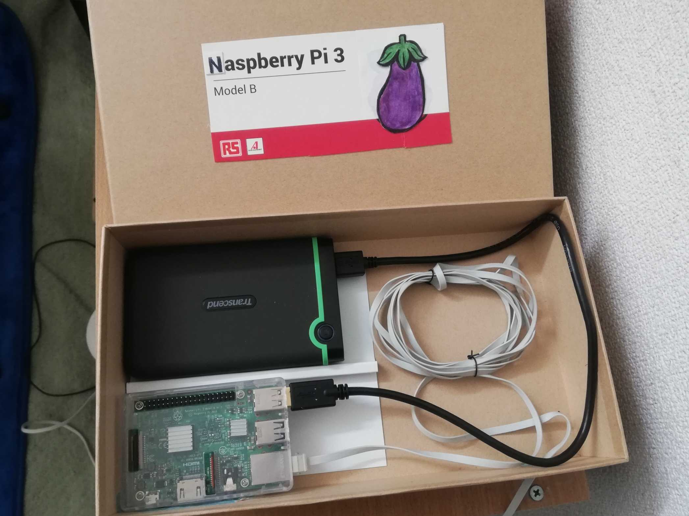
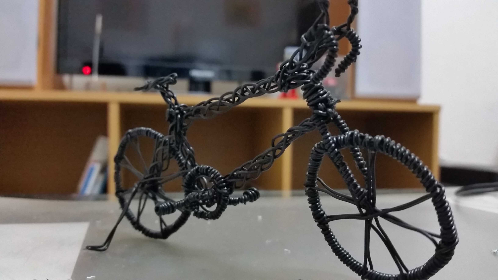
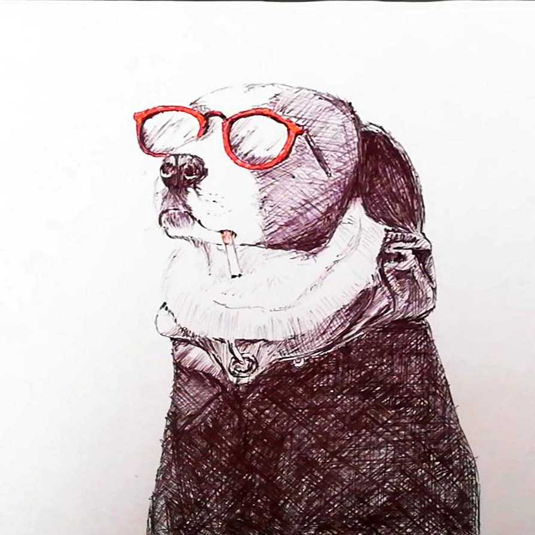

# o_dannyの制作物

 

# 0. 目次

| **番号** | **タイトル**                                                 |
| -------- | ------------------------------------------------------------ |
| **1**    | [**食パンの袋とめるアレ**](#1食パンの袋とめるアレ)          |
| **2**    | [**にゃんだーりすと**](#2にゃんだーりすと)                 |
| **3**    | [**あかねちゃんタイマー**](#3あかねちゃんタイマー)         |
| **4**    | [**Dinosour Run**](#4Dinosour Run)                         |
| **5**    | [**プログラミング教室の教材**](#5プログラミング教室の教材) |
| **6**    | [**ゲーム制作プロトタイプ**](#6ゲーム制作のための実験)     |
| **7**    | [**二足歩行ロボット**](#7二足歩行ロボット)                 |
| **8**    | [**ゲームコントローラー**](#8ゲームコントローラー)         |
| **9**    | [**その他電子工作**](#9その他電子工作)                     |
| **10**   | [**その他制作物**]($10その他制作物)                        |

 

# 1.食パンの袋とめるアレ

<iframe width="560" height="315" src="https://www.youtube.com/embed/vUrLMOghyeE" frameborder="0" allow="accelerometer; autoplay; encrypted-media; gyroscope; picture-in-picture" allowfullscreen></iframe>

**【種別】**

Androidゲーム

**【概要】**

2Dアクションシューティングゲームです。これはチームで開発し、私はプログラミングと進行管理をしました。

**【利用技術】**

Unity

**【制作期間】**

4か月程度

**【工夫した点と苦労した点】**

ゲームの操作性の調整に苦労しました。ゲームの全体像が完成した段階から本格的に調整に取り組みました。当たり判定の大きさや体力、速度などの各種パラメータの調整や効果音とエフェクトの調整といった詳細設定に取り組みました。細かな調整はさわり心地やゲーム体験の向上に大切な作業である一方、多くの労力を要しました。そこで私は各種パラメータの微調整を簡略化するためのテスト画面とツールを作成し、チームの作業を効率化するようにしました。

**【リンクなど】**

- **[Google Play Storeでの公開リンク](https://play.google.com/store/apps/details?id=com.Danny11.ArePac)**

- **[youtube リンク](https://www.youtube.com/watch?v=vUrLMOghyeE)**

 

# 2.にゃんだーりすと

**【種別】**

Android アプリ

**【概要】**

旧Wunderlistを模倣したToDoアプリです。友人と二人で機能を分担して開発しました。

**【利用技術】**

Android, Java, GitHub, SQL

**【制作期間】**

1か月程度（2019年8月～9月）

**【工夫した点と苦労した点】**

**【リンクなど】**

GitHub: [ToDoAppWithSQLite](https://github.com/dimorportheca47/ToDoAppWithSQLite-master)

 

# 3.あかねちゃんタイマー

**【種別】**

Windowsアプリケーション

**【概要】**

Gitプロジェクトの未commit数の確認と、作業時間の管理ができるアプリ

**【利用技術】**

Java, Swing, PowerShell

**【制作期間】**

二か月程度

**【工夫した点と苦労した点】**

工夫した点は自分が不便に感じている二つの課題を解決できるようにしたことです。一つ目の課題は、私が複数のGitプロジェクトを扱っていると、ついcommitを忘れてしまうことでした。そこでcommitしていない変更の数を常に表示するようにし、各プロジェクトをコマンドプロンプトで開けるボタンをつけました。二つ目の課題は、自分の作業時間を把握しておらず、今日何に何時間費やしたのかわからないことでした。これは作業時間と内容を記録できる機能をつけることで解決しました。

**【リンクなど】**

[GitHub リンク](https://github.com/dannyso16/akane-timer)

 

# 4.Dinosour Run

**【種別】**

PCゲーム

**【概要】**

オフラインの時によく見るランゲームです。オープンソースソフトウェアに貢献してみたい一心で短期間でつくりました。

**【利用技術】**

Pythonのレトロゲームエンジンpyxel、GitHub

**【制作期間】**

一週間（2019年1月）

**【工夫した点と苦労した点】**

短期間で、遊んでみたくなるゲームをつくれるように工夫しました。pyxelが公開されてまだ早い時期にゲームをつくることで、プロジェクトの発展に協力したいと思ったからです。早く作るために、既にUnityでプロトタイプをつくっていたランゲームをpyxelで実装することにしました。また遊んでみたくなるようにREADMEにはgifで面白さを伝え、実行方法も丁寧に書きました。結果として、複数の海外の方からプルリクエストをしていただいたほか、pyxelのwikiにも掲載していただきました。

**【リンクなど】**

[GitHubリンク](https://github.com/dannyso16/pynasour)

 

# 5.プログラミング教室の教材

**【種別】**

PCゲームとテキスト

**【概要】**

2019年8月に開催したプログラミング教室の教材です。

**【利用技術】**

Pythonのレトロゲームエンジンpyxel

**【制作期間】**

一か月

**【工夫した点と苦労した点】**

苦労した点は、プログラミング経験のない大学生が2時間で制作できる教材をつくったことです。プログラミング教室は有料で開催したので、人を集めるためにはお金を払っても良いと思える魅力的なコンテンツが必要でした。そこで私はプログラミングの基本構文でつくれる範囲でできるだけ面白そうなゲームを考えました。そして短い時間で理解できるように教え方を工夫しました。実際の開催までに知り合いに体験してもらい、より初心者が楽しく学べるようにしました。

**【リンクなど】**

[GitHubリンク](https://github.com/dannyso16/Play-IT)

 

# 6.ゲーム制作のための実験

**【種別】**

プロトタイプ

**【概要】**

群れアルゴリズム、ジャンプの実装方法の比較、疑似3D、ラスタースクロ―ルなど、ゲーム制作をしている中で気になったトピックを深堀りし、様々なアイデアを試しました。

**【利用技術】**

Python, Java, Javascriptなど

**【制作期間】**

各位一週間から一か月

**【工夫した点と苦労した点】**

アイデアを試し、発信し、議論したことが工夫であり、苦労した部分です。試した内容はいずれもネットで調べても実装例が少ないものばかりだったので、自分が悩んだ点と解決できなかった点を発信することは他のエンジニアにとって有益でした。特にQiitaに投稿した「[気持ちのいいジャンプを目指して](https://qiita.com/odanny/items/297f32a334c41410cc5d)」は2020年3月現在2万1000 viewsを達成し、様々な方からアイデアや自分の知らなかった知見を教えていただけました。

 

**ジャンプアルゴリズムの比較**

**ラスタースクロール**

**スイミー**　[Qiita - 群れアルゴリズムBoid](https://github.com/dannyso16/flocking)

**お絵描き**　[Qita - ペイントソフトを作って、ついでに手書き数字認識もする](https://qiita.com/odanny/items/eee3d99522bb01fdd111)

**makecode**：このまま遊べます。

<iframe style="position:absolute;top:0;left:0;width:100%;height:100%;" src="https://arcade.makecode.com/---run?id=_JY84PAPLvc7v" allowfullscreen="allowfullscreen" sandbox="allow-popups allow-forms allow-scripts allow-same-origin" frameborder="0"></iframe>

 

# 7.二足歩行ロボット

****

**【種別】**

電子工作

**【概要】**

オープンソースプロジェクトOttoを参考に作ったロボットです。サーボモーターを4つ使用し二足歩行やダンス、コントローラーで操作ができます。Gifでは基盤が外に出ていますが、スタンドアローンで動作します。

**【利用技術】**

Arduino

**【制作期間】**

一、二か月

**【工夫した点と苦労した点】**

オリジナルの機能はすべて実装しながら、独自の機能も追加したことです。OttoではソースコードやCADファイル、必要な部品の情報などがある程度充実していました。しかしながらオリジナルの動作はハードコーディングされており既定の動きしかできなかったり、指定の部品が高額で手を出しにくかったりして自分好みではないところがありました。そこで有り合わせの部品を使用して本体をつくり、プログラムを改造してコントローラーで操作できるようにしました。それだけではなく、過去に実装したことがあった音楽再生機能や拍手に反応する機能などを追加しました。

**【リンクなど】**

[otto](https://www.ottodiy.com/)

 

# 8.ゲームコントローラー

**【種別】**

電子工作

**【概要】**

スーパーファミコンや任天堂64のコントローラーをUSB化した

**【利用技術】**

Arduino

**【制作期間】**

一、二か月

**【工夫した点と苦労した点】**

苦労した点は自分でプログラムを書いたことです。ゲームコントローラーの通信プロトコルは公式には公開されていませんが、有志が解析した情報があります。そして既にArduinoでUSBデバイス化する記事もいくつかありました。それらのプログラムはプロトコル通りに実装されていたものの、Arduinoのプログラム実行時間が考慮されておらず、うまく動きませんでした。そこでプログラムの高速化を行う工夫をしました。

**【リンクなど】**

- [記事](https://qiita.com/odanny/items/686d2e3f2061c12f156f)

中身

 

# 9.その他電子工作

**【種別】**

プロトタイプ

**【概要】**

アイデアベースで試作したもの

**【利用技術】**

Arduino, Raspberry pi, Linux

**【制作期間】**

各一週間程度

**【工夫した点と苦労した点】**

思いついたものを試しました。
 

**触れずにON／OFFできる間接照明**

**NASの自作と運用**

 

# 10.その他制作物

**【種別】**

イラストほか

**【概要】**

ソフトウェアエンジニアには関係のない制作物

**【制作期間】**

各数日程度
 

**ワイヤアート**

**イラスト**

**おりがみ**

