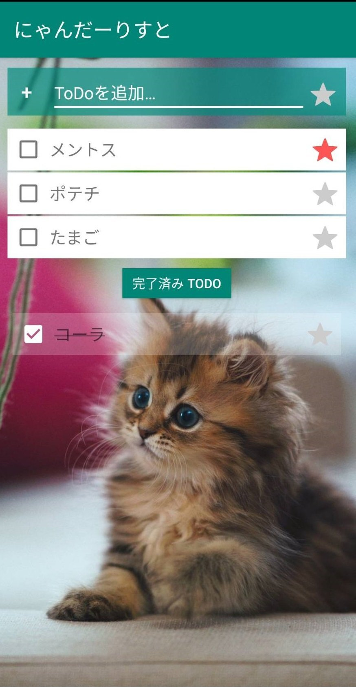

# odannyの作品置き場

# 食パンの袋とめるアレ(Unity)

google play での公開リンク　https://play.google.com/store/apps/details?id=com.Danny11.ArePac

youtube リンク　https://www.youtube.com/watch?v=vUrLMOghyeE

ヘッダ

# TODOアプリ(Androidアプリ)

GitHub: 

# あかねちゃん(Windowsアプリ)

https://github.com/dannyso16/akane-timer

# ダイナソー

オープンソースのpyxel wiki にのった

https://github.com/dannyso16/pynasour

# ひよこ

https://qiita.com/odanny/items/297f32a334c41410cc5d

比較

比較

疑似3d

ゆらゆら

# スイミー

https://github.com/dannyso16/flocking

https://qiita.com/odanny/items/e0c0a00e13c2b4839cec

# Processing

# お絵描きソフト

https://github.com/dannyso16/pyxelDigitRecognition

https://qiita.com/odanny/items/eee3d99522bb01fdd111

# NAS(Raspberry pi)

# 二足ロボット(Arduino)

# ゲームコントローラー(Arduino)

記事：https://qiita.com/odanny/items/686d2e3f2061c12f156f

中身

# 自動ライト(Arduino)

# makecode

https://o-danny.itch.io/clickingbuttonsimulator

# 記事

# ワイヤアート

# イラスト

